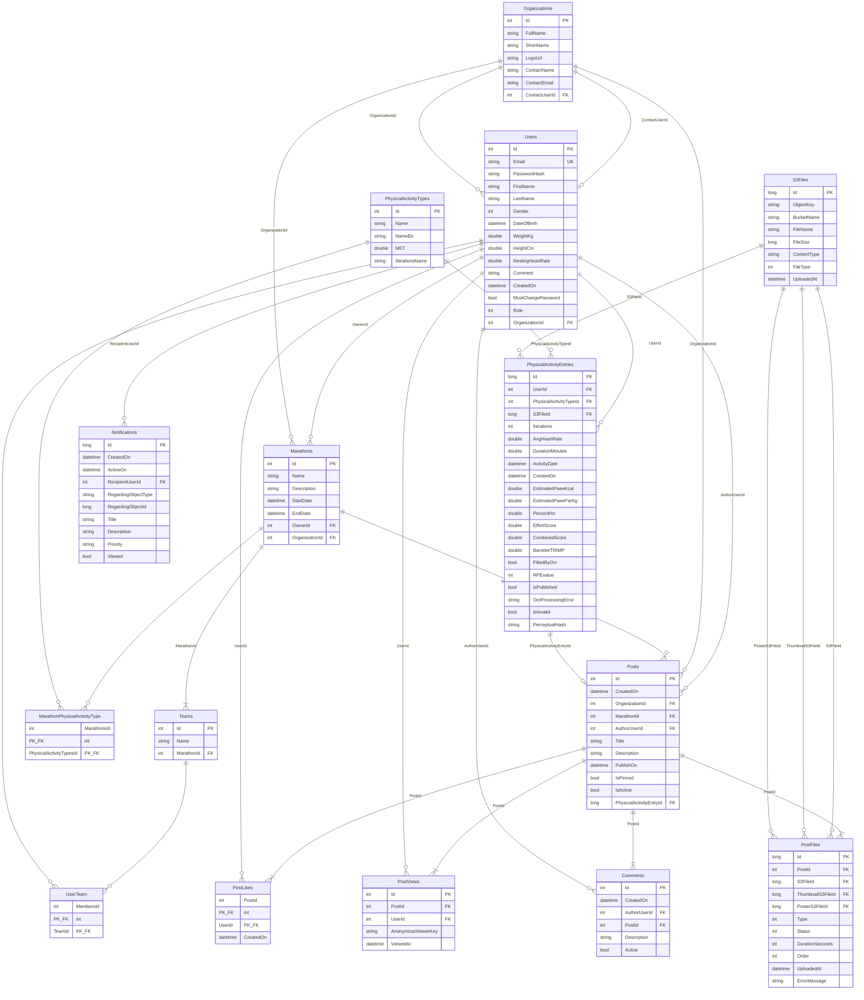
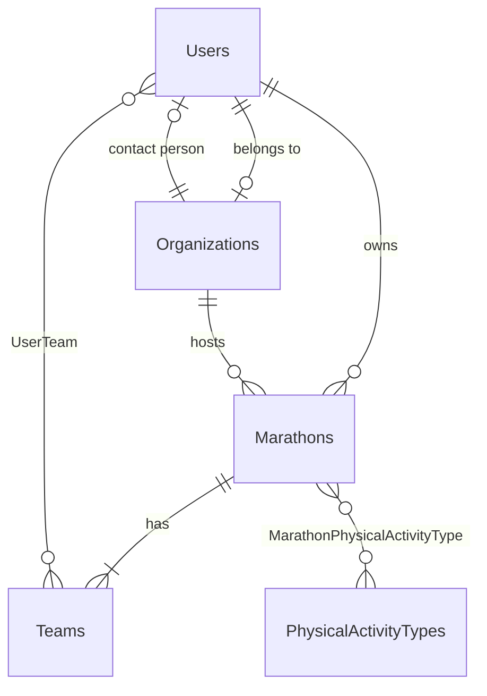
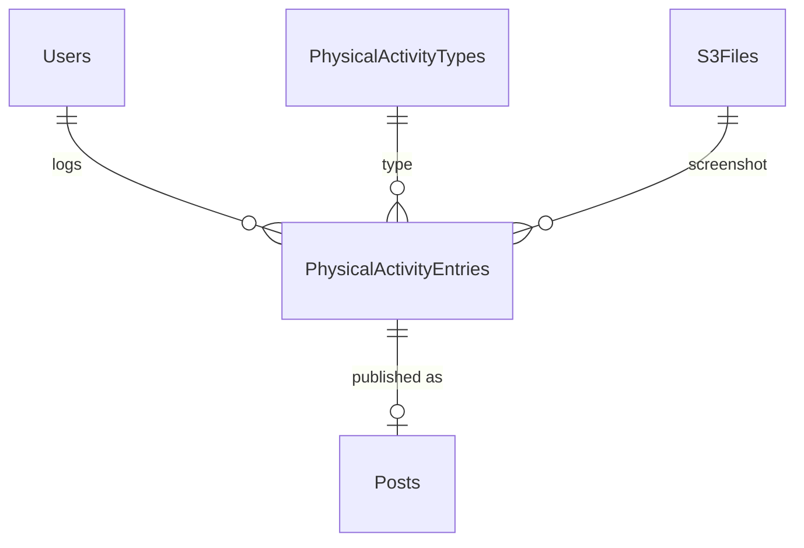
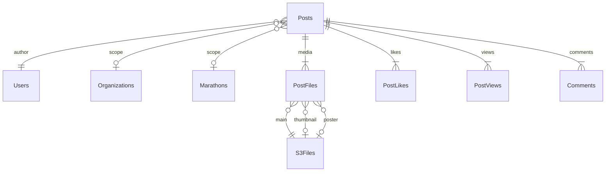

# ERD — Health Marathon

Диаграмма сущностей приложения **CalorieTracker** (база данных `health_marathon`, PostgreSQL, Entity Framework Core 8).

Источник истины: сущности в `Core/Entities/`, конфигурация в `Infrastructure/Data/AppDbContext.cs`.

---

## Обзор доменов

| Домен | Таблицы | Назначение |
|-------|---------|------------|
| Пользователи и организации | `Users`, `Organizations` | Аутентификация, профили, роли, принадлежность к организации |
| Марафоны | `Marathons`, `Teams`, `UserTeam`, `MarathonPhysicalActivityType` | Соревнования, команды, допустимые типы активностей |
| Активности | `PhysicalActivityTypes`, `PhysicalActivityEntries` | Типы тренировок, записи с метриками (калории, TRIMP) |
| Файлы | `S3Files` | Метаданные файлов в S3/MinIO |
| Лента | `Posts`, `PostFiles`, `PostLikes`, `PostViews`, `Comments` | Публикации, медиа, лайки, просмотры, комментарии |
| Уведомления | `Notifications` | In-app уведомления пользователям |

**Всего:** 13 сущностей → 15 таблиц (включая 2 join-таблицы).

---

## Полная диаграмма связей



---

## Диаграммы по доменам

### Пользователи, организации, марафоны



### Участие пользователя в марафоне

Прямого FK между `Users` и `Marathons` для **участников** нет. Связь строится через команды:

```
Users ──N:M──► UserTeam ──► Teams ──N:1──► Marathons
```

| Узел | Ограничение |
|------|-------------|
| `Teams` → `Marathons` | Каждая команда принадлежит **ровно одному** марафону (`Teams.MarathonId`, связь N:1) |
| `Users` → `Teams` | Пользователь может состоять в **одной или нескольких** командах (`UserTeam`, связь N:M) |
| `Users` → `Marathons` | Участие в марафоне — **косвенное**: пользователь → команда → марафон |

Отдельно от участия: пользователь может **владеть** марафоном напрямую (`Marathons.OwnerId` → `Users`).

Один пользователь теоретически может состоять в командах разных марафонов (несколько записей в `UserTeam` с разными `TeamId`).

### Активности и файлы



### Лента (социальный слой)



---

## Связи (FK)

| От | К | Тип | FK / Join | On Delete |
|----|---|-----|-----------|-----------|
| `Users` | `Organizations` | N:1 | `OrganizationId` | default |
| `Organizations` | `Users` | N:1 | `ContactUserId` | default |
| `Users` | `Teams` | N:M | `UserTeam` (`MembersId`, `TeamId`) | cascade |
| `Users` | `Marathons` | N:M *(косвенно)* | через `UserTeam` → `Teams.MarathonId` | cascade (через join) |
| `Marathons` | `Users` | N:1 | `OwnerId` (владелец, не участник) | cascade |
| `Marathons` | `Organizations` | N:1 | `OrganizationId` | default |
| `Teams` | `Marathons` | N:1 | `MarathonId` | cascade |
| `Marathons` | `PhysicalActivityTypes` | N:M | `MarathonPhysicalActivityType` | cascade |
| `PhysicalActivityEntries` | `Users` | N:1 | `UserId` | cascade |
| `PhysicalActivityEntries` | `PhysicalActivityTypes` | N:1 | `PhysicalActivityTypeId` | default |
| `PhysicalActivityEntries` | `S3Files` | N:1 | `S3FileId` | default |
| `Posts` | `Users` | N:1 | `AuthorUserId` | cascade |
| `Posts` | `Organizations` | N:1 | `OrganizationId` | default |
| `Posts` | `Marathons` | N:1 | `MarathonId` | default |
| `Posts` | `PhysicalActivityEntries` | N:1 | `PhysicalActivityEntryId` | **SetNull** |
| `PostFiles` | `Posts` | N:1 | `PostId` | cascade |
| `PostFiles` | `S3Files` | N:1 | `S3FileId`, `ThumbnailS3FileId`, `PosterS3FileId` | cascade (main) |
| `PostLikes` | `Posts`, `Users` | N:1 | composite PK (`PostId`, `UserId`) | cascade |
| `PostViews` | `Posts`, `Users` | N:1 | `PostId`, `UserId?` | cascade |
| `Comments` | `Posts`, `Users` | N:1 | `PostId`, `AuthorUserId` | cascade |
| `Notifications` | `Users` | N:1 | `RecipientUserId` | cascade |

### Полиморфная связь (без FK в БД)

`Notifications.RegardingObjectType` + `RegardingObjectId` — логическая ссылка на `PhysicalActivityEntry`, `Post`, `Marathon`, `Organization` или `User`. Ограничение целостности на уровне приложения.

---

## Перечисления (enum)

| Enum | Значения | Где хранится |
|------|----------|--------------|
| `Gender` | Male, Female | `Users.Gender` (int) |
| `Role` | RegularUser, Moderator, Administrator | `Users.Role` (int) |
| `FileType` | Image, Video, VideoPoster, Thumbnail | `S3Files.FileType`, `PostFiles.Type` (int) |
| `FileStatus` | Ready, Processing, Completed, Failed | `PostFiles.Status` (int) |
| `RegardingObjectType` | None, PhysicalActivityEntry, Post, Marathon, Organization, User | `Notifications.RegardingObjectType` (**string**) |
| `NotificationPriority` | Info, Warning, Error | `Notifications.Priority` (**string**, default Info) |

---

## Вычисляемые и немаппируемые поля

| Сущность | Поле | Примечание |
|----------|------|------------|
| `User` | `Age` | `[NotMapped]` — вычисляется из `DateOfBirth` |

---

## Индексы (ключевые)

| Таблица | Индекс | Назначение |
|---------|--------|------------|
| `Users` | `Email` (unique) | Уникальный логин |
| `PhysicalActivityEntries` | `(UserId, ActivityDate)`, `ActivityDate` | Статистика и выборки по дате |
| `Posts` | `(IsActive, PublishOn)`, `CreatedOn` | Лента публикаций |
| `PostViews` | `(PostId, UserId)` unique where UserId IS NOT NULL | Уникальный просмотр (авторизованный) |
| `PostViews` | `(PostId, AnonymousViewerKey)` unique where UserId IS NULL | Уникальный просмотр (анонимный) |
| `Comments` | `(PostId, Active, CreatedOn)` | Комментарии к посту |
| `Notifications` | `(RecipientUserId, Viewed)`, `(RecipientUserId, ActiveOn)` | Список уведомлений |

---

## Внешние системы (не в БД)

Следующие компоненты **не отражены** на диаграмме как таблицы:

| Система | Роль |
|---------|------|
| **S3 / MinIO** | Хранение бинарных файлов; в БД только метаданные (`S3Files`) |
| **ImageFaxNet.Api** | OCR/распознавание скриншотов активностей; отдельный сервис без DbContext |
| **Metabase** | BI-аналитика; read-only доступ к `health_marathon` |
| **Scheduler** | Фоновые задачи; использует тот же `AppDbContext` |

---

## Файлы исходного кода

| Компонент | Путь |
|-----------|------|
| Сущности | `Core/Entities/*.cs` |
| DbContext | `Infrastructure/Data/AppDbContext.cs` |
| Миграции | `Infrastructure/Migrations/` |
| Enum-ы | `Core/Enums/`, `Core/Entities/User.cs` (Gender, Role) |
